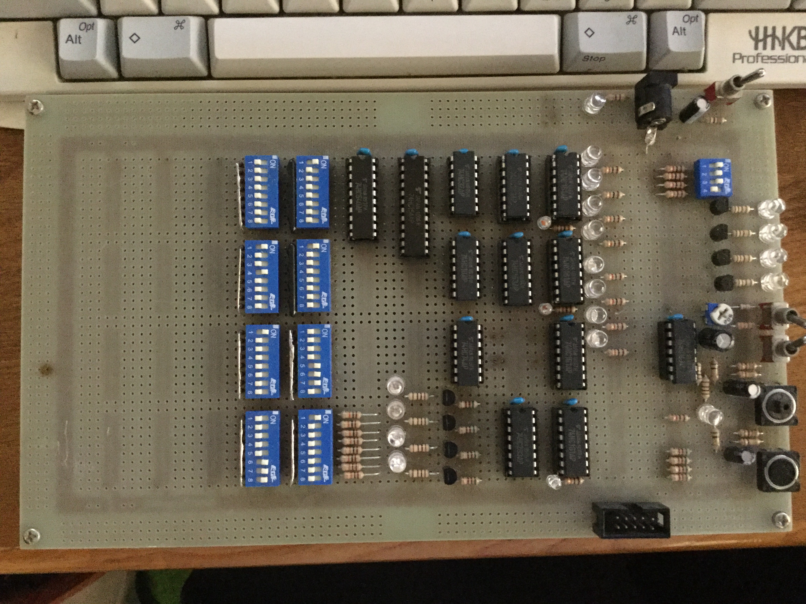
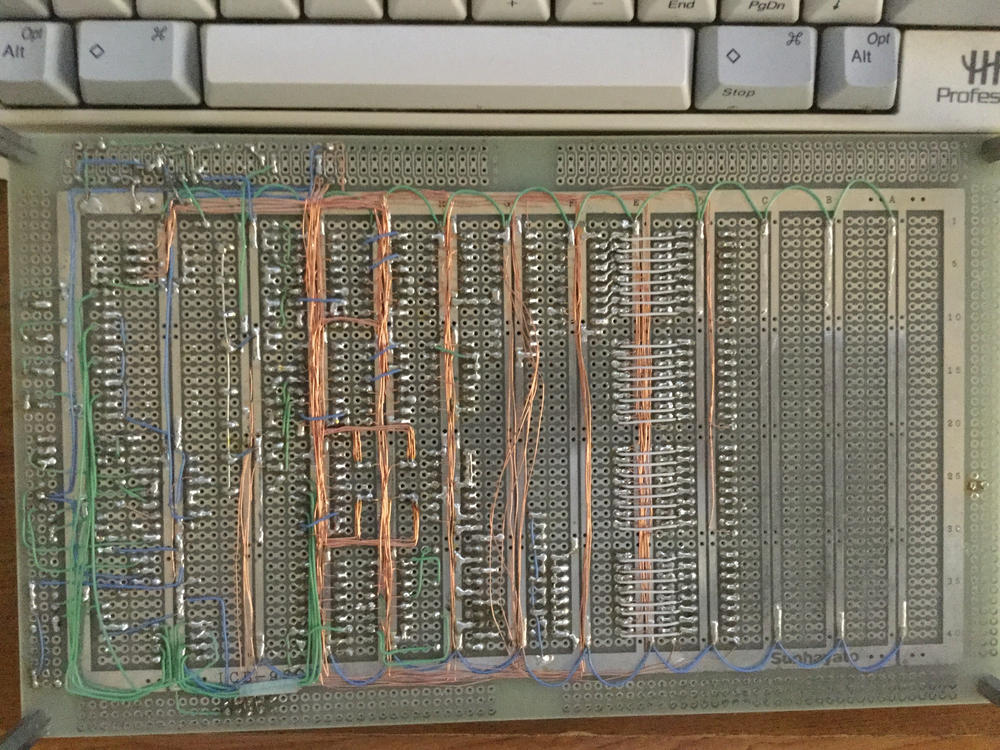

# 大昔に作った4bitのRISC系物理CPU
知識的に現在でも色褪せない名著である「CPUの造り方」という本を元に1年くらいかけて作ったもの

### できること
- 代入
- 足し算(signed前提にして、負数の値を設定すれば引き算も可能)
- ジャンプ命令
- LEDなどへの出力(4bitの出力端子を使って四駆などの操作も可能)

### レジスタ
2つ

### クロック
- 手動
- 1Hz
- 10Hz

### なぜ作ったか
小さな頃に電子回路の美しさに目を奪われたのがキッカケで電子回路に興味を抱くようになった。
 
大学生は機械工学を専攻していたが、Pentium4が採用しているNetBurstアーキテクチャの構造や問題点、PS2のCPUとGPUの構造や問題点に興味があり、色々調べるくらいにはアーキテクチャに興味があった。
 
その後、ニートで時間があったため、入門書やネットの情報を使って勉強していた時に、ネットでこの本の存在を知り、CPUの動きを設計レベルで理解し、実際に作って美しく仕上げたいという思いが抑えきれなくなったため。
 

### 感想
CPUの動きを理解するのにとてもタメになった
 
配線を綺麗にしたくてはんだ付けが辛すぎて地獄だった
 
グレイコードとカルノー図を駆使する命令デコーダの設計がとても難しい
 
小さい頃からの夢だったこともあり、見よう見まねではあるものの初めて物理のCPUを作れてともて嬉しかった

 

